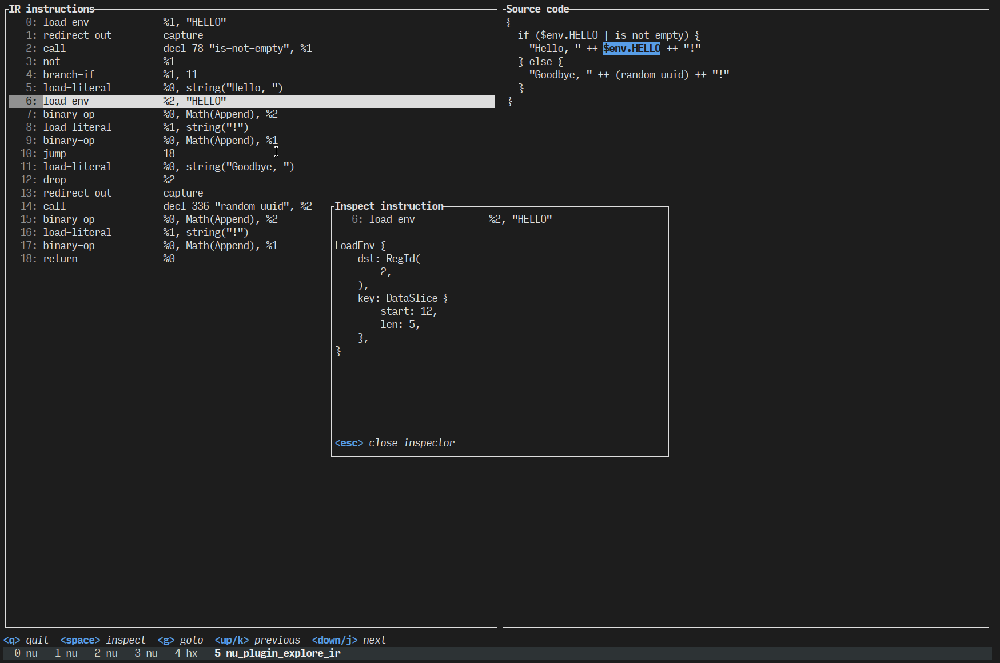

# nu_plugin_explore_ir

This is a fancy viewer for internal representation (IR) code in Nushell. Example:

```nushell
explore ir {
  if ($env.HELLO | is-not-empty) {
    "Hello, " ++ $env.HELLO ++ "!"
  } else {
    "Goodbye, " ++ (random uuid) ++ "!"
  }
}
```



Key bindings:

| Key            | Effect                                                          |
| -------------- | --------------------------------------------------------------- |
| **q**          | Quit the application.                                           |
| **SPACE**      | Open the inspector, which shows debug info for the instruction. |
| **g**          | Go to a specific instruction by index.                          |
| **↑** or **k** | Go to the previous instruction.                                 |
| **↓** or **j** | Go to the next instruction.                                     |
| **[**          | Go back after jumping to an instruction's target.               |
| **]**          | Jump into an instruction's target (branch or call decl / block) |
| **ESC**        | Close a dialog box or prompt.                                   |

With the **[** and **]** keys it is easy to navigate through IR code and jump into blocks referenced by literals, (custom) declarations in `call` instructions, or branch targets.

